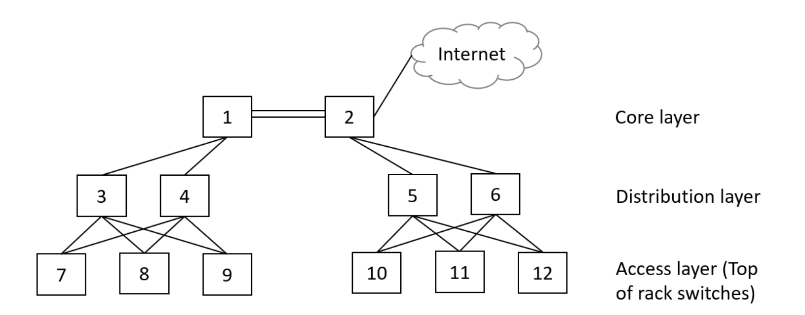
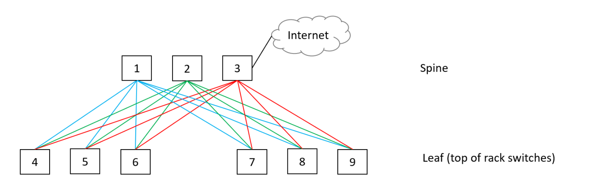

# Datacenter-Network-Analysis

This is my project for the class EE550: Data Networks: Design and Analysis. It compares the network performance of 3-layer model vs. spine and leaf model of datacenter network architectures. Traditionally, datacenters follow a 3-layer model, the core layer, distribution layer, and access layer. Where the access layer represents the TOR(Top of Rack) switches. In recent years, cloud computing has become highly popular. This creates a demand towards East-West traffic (communication within the nodes of the datacenter itself). To accommodate this trend, the spine and leaf model was introduced. But how much exactly is the performance improvement(in terms of network throughput) and what are the tradeoffs? This analysis attempts to answer the questions using Drift Plus Penalty(DPP) algorithm. DPP is an optimization technique in the family of Lagrange multiplier and Linear programs solvers. 

Below shows the network topology of the 3-layer model and the spine and leaf model.

Traditional 3-layer datacenter architecture model

New spine and leaf datacenter architecture model

